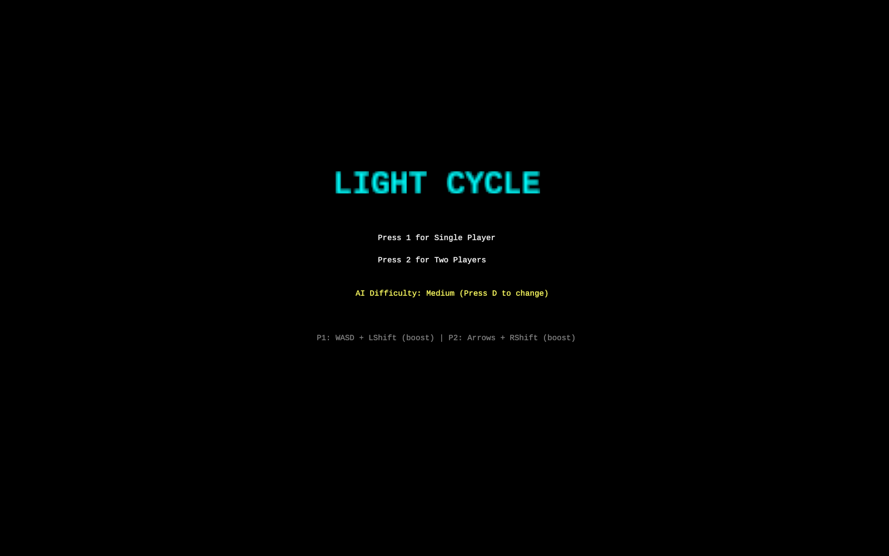

# LightCycle

A classic TRON-inspired light cycle game built with Rust and ggez.




## Features

- **Single-player and Two-player modes** - Battle against AI or a friend
- **Adjustable AI Difficulty** - Easy, Medium, and Hard AI opponents
- **Boost Mechanic** - Limited energy boost system for strategic gameplay
- **Visual Effects** - Particle trails, screen shake, and glow effects
- **Pause Menu** - Full pause functionality with in-game controls
- **Retro Aesthetic** - 8-bit styled graphics with neon colors

## Controls

### Menu
- `1` - Start single-player game
- `2` - Start two-player game
- `D` - Cycle AI difficulty (Easy/Medium/Hard)

### Player 1
- `W`/`A`/`S`/`D` - Movement
- `Left Shift` - Boost

### Player 2
- `Arrow Keys` - Movement
- `Right Shift` - Boost

### General
- `P` - Pause/Resume
- `ESC` - Return to menu

## Installation

### Prerequisites
- Rust (latest stable version)
- Cargo

### Building and Running

```bash
# Clone the repository
git clone https://github.com/Tortured-Metaphor/LightCycle.git
cd LightCycle

# Build the project
cargo build --release

# Run the game
cargo run --release
```

### Linux Dependencies

Building this project on Linux requires several system libraries. Install them with:

**Debian/Ubuntu:**
```bash
sudo apt-get install libasound2-dev libudev-dev pkg-config build-essential
```

**Fedora:**
```bash
sudo dnf install alsa-lib-devel systemd-devel
```

**Arch Linux:**
```bash
sudo pacman -S alsa-lib systemd pkgconf
```

## Gameplay

Navigate your light cycle around the arena, leaving a trail behind you. Avoid crashing into walls, your own trail, or your opponent's trail. The last cycle standing wins!

Use your boost strategically - it doubles your speed but drains energy quickly. Energy regenerates when not boosting.

## AI Difficulty Levels

- **Easy**: Shorter reaction time, makes mistakes more often
- **Medium**: Balanced gameplay, moderate challenge
- **Hard**: Advanced pathfinding, optimal decision making, aggressive boost usage

## Development

Built with:
- [Rust](https://www.rust-lang.org/) - Systems programming language
- [ggez](https://ggez.rs/) - Rust game framework

## Version History

- v0.2.0 - Added pause menu, boost mechanics, AI difficulties, visual effects
- v0.1.0 - Initial game implementation

## License

This project is open source and available under the MIT License.
